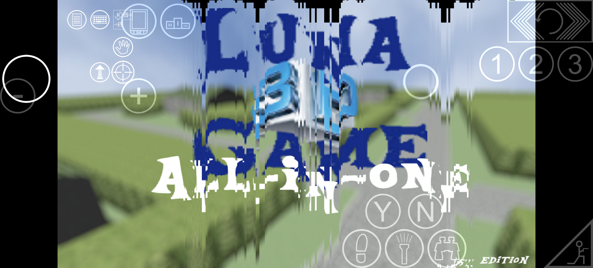

# Luna Game 3D 

<p align="center">
  
</p>

<p align="center">
  
</p>

Luna Game 3D is an Android port project based on the `idTech4A++` / `Q3E` codebase, customized for `Luna Game` branding, package name migration, direct game launch flow, control migration, and UZDoom-focused runtime integration.

## Project Name

- Main project title: `Luna Game 3D`
- In-app game label: `Luna Game`
- Android package: `com.luna.game`

## Author And References

- `Luna Game 3D` Android port author and maintainer: [Ajwyunsx](https://github.com/Ajwyunsx)
- Luna Game 3D repository: [Ajwyunsx/Luan-Game-3D-Mobile](https://github.com/Ajwyunsx/Luan-Game-3D-Mobile)
- Original `Luna Game` series creator: `Anonymous Creator`
- Original `Luna Game` official reference: [lunaga.me](https://lunaga.me/)
- Original creator statement: the official site says the creator has "no plans on revealing my identity at this point"
- Upstream author reference: [glKarin](https://github.com/glKarin)
- Original Android idTech / Q3E author reference: [n0n3m4](https://github.com/n0n3m4)
- Upstream reference: [glKarin/com.n0n3m4.diii4a](https://github.com/glKarin/com.n0n3m4.diii4a)

## Current Customization

- Renamed the Android app to `Luna Game 3D`
- Updated the application ID to `com.luna.game`
- Added Luna Game themed icon and splash artwork
- Migrated launcher and runtime flow to enter the game directly
- Migrated on-device control configuration from the previous package
- Kept UZDoom-related resources and mobile control integration

## Build

This project uses Android Gradle and includes the `idTech4Amm` app module plus the `Q3E` engine frontend module.

```bash
gradlew.bat :idTech4Amm:assembleDebug
```

Generated debug APK example:

```text
idTech4Amm/build/outputs/apk/debug/idTech4Amm-debug.apk
```

## Notes

- This repository contains the Luna Game 3D customization layer built on top of upstream open-source engine work.
- This project is not the original `Luna Game` fangame series release. The original series is credited to its anonymous creator on the official `lunaga.me` site.
- Please keep upstream attribution when redistributing modified builds or source snapshots.
- If you use this project as a base, keep the `Luna Game 3D` and `Luna Game` project naming clear when referring to this customized fork.
